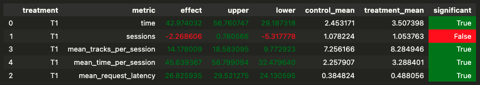

# Домашняя работа (улучшение рекомендательной системы)


### Краткое описание результатов

В рамках работы был разработан алгоритм рекомендательной системы *Ultra Power*.

AB-тесты показывают, что данный рекоммендер улучшает значение метрики *mean_time_per_session* (около 45.6% прироста).

### Описание рекомендера *Ultra Power*

1. Данный алгоритм основывается на рекомендере *Contextual*, но с некоторыми изменениями.

2. Рекомендации нейросети могут быть получены при запуске `jupyter/train_dnn_weights.ipynb`.
В данном ноутбуке была реализована нейронная сеть, которая обучалась на тройках *(start_track, previous_track, track)* и целевой переменной *time* (время прослушивания).
Для преобразования и построения рекомендаций использовалась матрицы эмбеддингов previous_track_embeddings

3. Сам рекомендер устроен так:
    - Если у пользователя нет построенных для него рекомендаций - то ему случайно предлагается один из N популярных треков. В текущей реализации `N = 100`

    - Если трек не максимально понравился пользователю (время прослушивания меньше `threshold = 0.8`), то мы рекомендуем один из N популярных треков

    - Также с вероятностью `p = 5%` мы рекомендуем случайный трек пользователю

    - Если же трек понравился пользователю (время прослушивания больше `threshold = 0.8`), то мы будем продолжать рекомендовать ему треки из его рекомендаций

4. Далее проведено AB-тестирование для нашего рекомендера, где контрольным алгоритмом является *Contextual*.


### Инструкцию по запуску

1. Первое, необходимо запустить из корневой директории скрипт `sh start.sh` (в ходе него необходимо будет ввести с клавиатуры `"n"`). Но предварительно нужно запустить следующий команды:
```
cd sim/
conda create --name recsys_sim python=3.7
conda activate recsys_sim
pip install -r requirements.txt
export PYTHONPATH=${PYTHONPATH}:.
cd ..
sh start.sh
```

2. Для подсчета метрик тестирования необходимо запустить все ячейки (Run All Cells) в ноутбуке `jupyter/Week1Seminar.ipynb`

